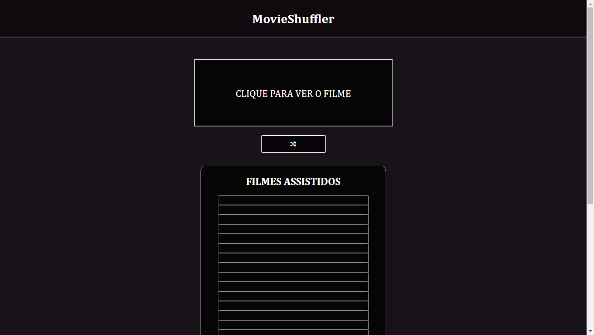

# MovieShuffler

## :page_facing_up: Sobre o Projeto
- Este projeto trata-se de uma landing page desenvolvida no Visual Studio Code com a finalidade de pôr em prática meus conhecimentos em JS.
- Criado em 14/06/2022
---

## :framed_picture: Imagens do Projeto

---
## :man_technologist:  Autor

<table class="author">
  <tr>
    <td align="center">
      <a href="https://www.linkedin.com/in/carloosf/">
        
         
        
          <b>Carlos Silva</b>
        
      </a>
    </td>
  </tr>
</table>   
   Linkedin:
   https://www.linkedin.com/in/ccarlossilv/
   
   E-mail: contato.carlossilvaf@gmail.com
